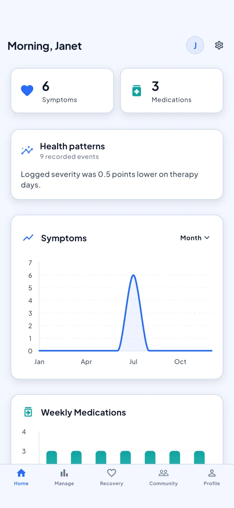
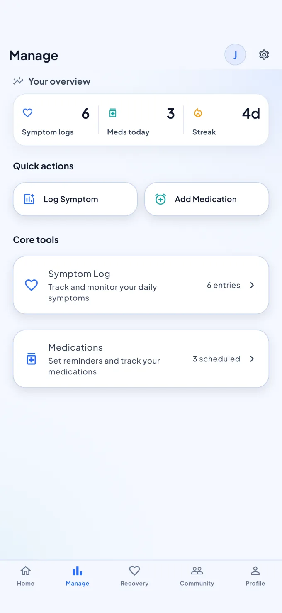
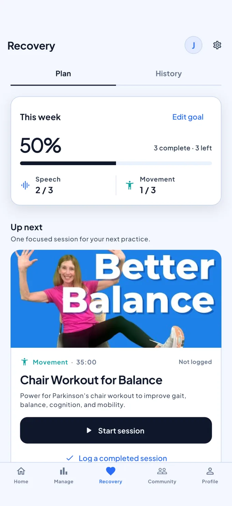
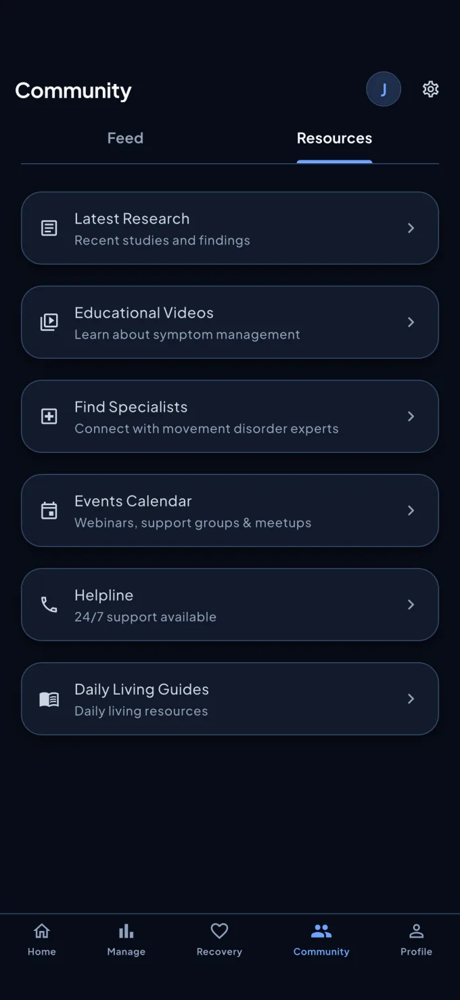

<div align="center">


# parkiwell.com

**The story of a calmer care day, told by scrolling through one.**

The marketing site for [ParkiWell](https://github.com/ParkiWell/ParkiWell), a
Parkinson's care companion for iPhone and Android.

[**parkiwell.com**](https://parkiwell.com) · Coming soon to the App Store and Google Play

</div>

---

<!-- screens:start -->
<p align="center">
  
  
  
  
</p>
<!-- screens:end -->

## What the site does

The home page is one continuous story rather than a stack of marketing
sections. You scroll through a day with the app: a check-in, a dose, a
practice session, somewhere to turn for help. Then it explains where your
health records live, what is being built next, and answers the questions
people actually ask.

### It reads as one page, not five

The background is a single colour moving. Every chapter opens on the exact
tone the chapter above it closed on, so scrolling walks a whole palette from
warm paper through clay, sage and steel and back again without a single
visible seam. Light and dark are separate palettes, not one turned down.

### The scroll has weight

The page waits for you to stop, then settles onto the nearest chapter with a
little give, the way something with mass does. Nothing is ever taken from
you: any scroll, tap or key cancels it, a long flick crosses the whole page,
and the end of the page is somewhere you are allowed to stop.

### It works the way you need it to

Light and dark themes, chosen or followed from your system. Reduced motion
support that swaps the pinned sequences for a plain stacked story instead of
just freezing them. Real focus rings, a skip link, labelled controls, and
large touch targets throughout.

### It is honest about the app

Every claim on the site has to be true of the shipped app. The privacy policy
and terms are the same documents the app ships with. The movement coach is
described as being explored, because it is.

## Built for trust

- **No third party requests.** Fonts, images and scripts all come from this
  origin. A Content Security Policy enforces it rather than trusting us to
  remember.
- **No analytics, no tracking, no cookies.** There is nothing to consent to
  because nothing is collected.
- **The launch list holds an email address and nothing else.** Your browser
  never talks to the database; the server writes the row. The key it uses can
  add an address and cannot read the list back.
- **Fast by default.** Every page is prerendered, screenshots are served
  immutable, and the whole thing is a single origin with no client side
  routing to wait for.

Read the [Privacy Policy](https://parkiwell.com/privacy), the
[Terms of Service](https://parkiwell.com/terms), or visit
[Support](https://parkiwell.com/support).

## Medical disclaimer

ParkiWell is an organizational and educational tool. It is **not** a medical
device and does not provide medical advice, diagnosis, or treatment. Always
consult your care team about your health.

## For developers

Next.js App Router, React, TypeScript and Tailwind, with Motion for the
scroll-driven sequences and Playwright for cross-browser checks. The launch
list is a Route Handler that writes to the same Supabase project the app uses.

```bash
npm install
npm run dev            # http://localhost:3000

npm run lint           # eslint
npm run build          # type check and static build
npm run test           # playwright, desktop Chromium and mobile WebKit
```

Product screenshots are generated from the app repository, with a content hash
in each filename so the immutable caching stays honest:

```bash
node scripts/screens.mjs ../ParkiWell/marketing/raw
```

The launch list needs `supabase/launch_list.sql` applied to the project and
`SUPABASE_URL` and `SUPABASE_ANON_KEY` set; see [.env.example](.env.example).
Without them the form says it is unavailable rather than pretending to have
saved anything. Deployment is written up in
[docs/DEPLOYING.md](docs/DEPLOYING.md).
