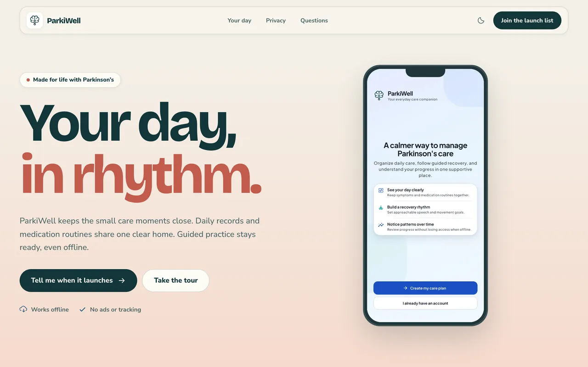
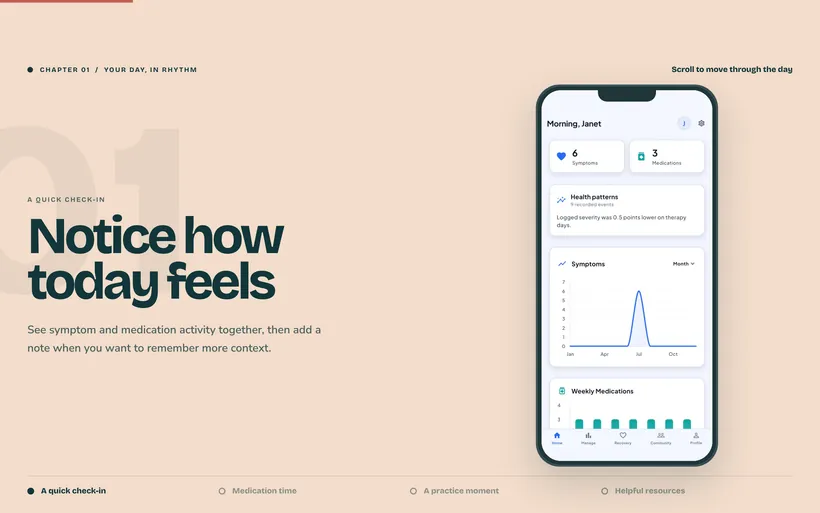
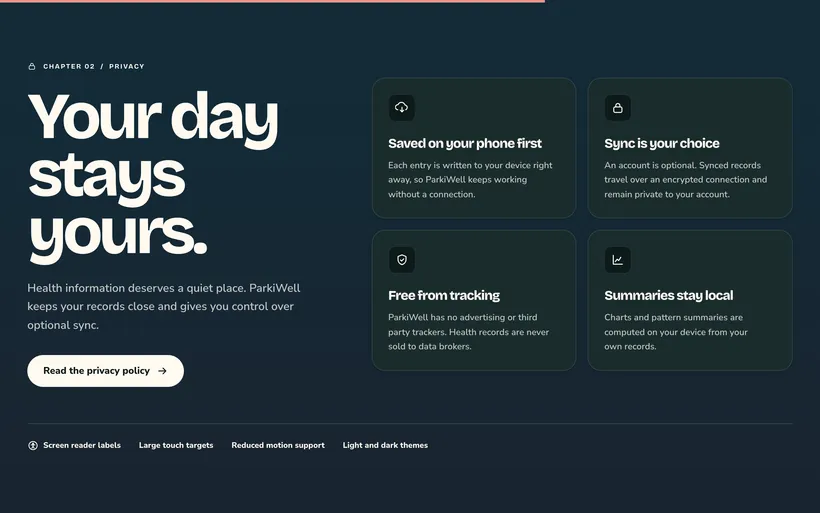
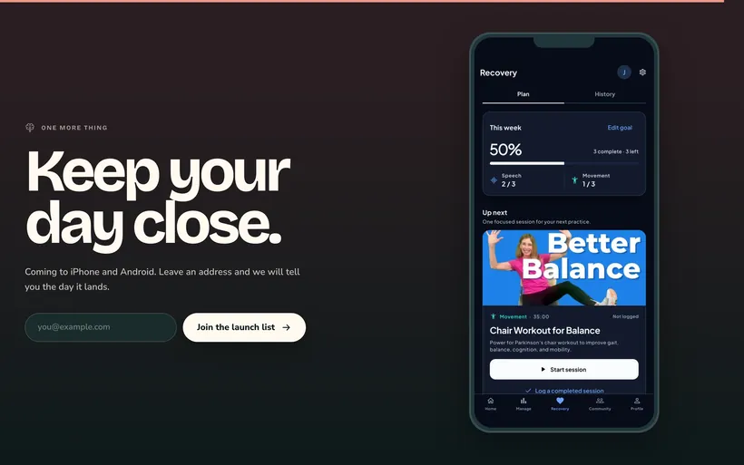

<div align="center">


# parkiwell.com

**The story of a calmer care day, told by scrolling through one.**

The marketing site for [ParkiWell](https://github.com/ParkiWell/ParkiWell), a
Parkinson's care companion for iPhone and Android.

[**parkiwell.com**](https://parkiwell.com) · Coming soon to the App Store and Google Play

</div>

---

<!-- site-shots:start -->
<p align="center">
  
</p>
<p align="center">
  
  
  
</p>
<!-- site-shots:end -->

## Built for trust

- **No third party requests.** Fonts, images and scripts all come from this
  origin. A Content Security Policy enforces it rather than trusting us to
  remember.
- **No analytics, no tracking, no cookies.** There is nothing to consent to
  because nothing is collected.
- **The launch list holds an email address and nothing else.** Your browser
  never talks to the database; the server writes the row. The key it uses can
  add an address and cannot read the list back.
- **Fast by default.** Every page is prerendered, screenshots are served
  immutable, and browser assets all come from one origin.

Read the [Privacy Policy](https://parkiwell.com/privacy), the
[Terms of Service](https://parkiwell.com/terms), or visit
[Support](https://parkiwell.com/support).

## Medical disclaimer

ParkiWell is an organizational and educational tool. It is **not** a medical
device and does not provide medical advice, diagnosis, or treatment. Always
consult your care team about your health.

## For developers

Next.js App Router, React, TypeScript and Tailwind, with Motion for the
scroll-driven sequences and Playwright for cross-browser checks. The launch
list is a Route Handler that writes to the same Supabase project the app uses.

```bash
npm install
npm run dev            # http://localhost:3000

npm run lint           # eslint
npm run build          # type check and static build
npm run test           # playwright, desktop Chromium and mobile WebKit
```

Both sets of pictures are generated, with a content hash in each filename so
the immutable caching stays honest and the readme cannot rot into broken
images. The product screenshots come from the app repository; the ones above
are of this site:

```bash
node scripts/screens.mjs ../ParkiWell/marketing/raw   # app screens
node scripts/readme-shots.mjs                         # this readme, needs a running server
```

The launch list needs `supabase/launch_list.sql` applied to the project and
`SUPABASE_URL` and `SUPABASE_ANON_KEY` set; see [.env.example](.env.example).
Without them the form says it is unavailable rather than pretending to have
saved anything.

See [the search visibility guide](docs/seo.md) for page metadata, feature
content, share artwork, sitemap maintenance, and Search Console setup.
